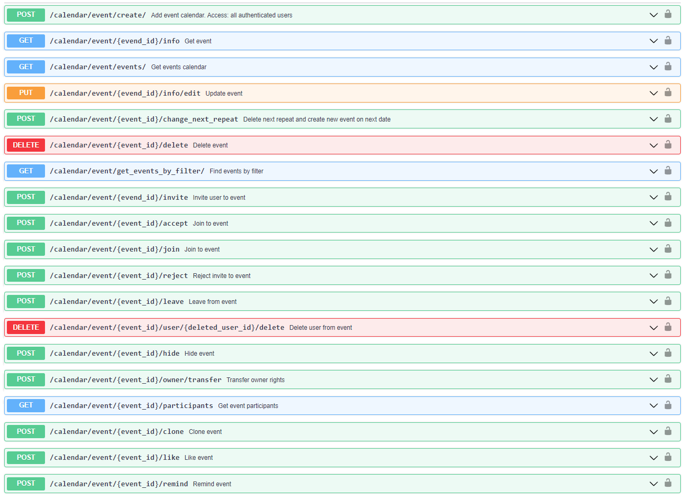
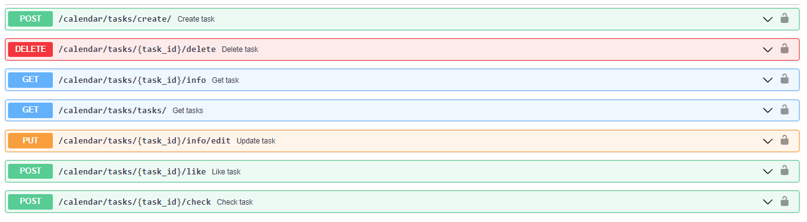

# core-calendar

Generated from cookiecutter template
---

## Development

### Install dependencies

```
pip install -r requirements-dev.txt -U
```

### Тестирование:
```
Чтобы протестировать модуль необходимо выполнить команду: docker-compose up - d
Отключить службу постгреса если он установлен в системе во избежание конфликта с контейнером постгреса
Запустить файл db_init.py
Данный файл создаст необходимые модели и триггеры в БД
```


### Install git hooks

```
pre-commit install --install-hooks
```

## Run service

```
mv .env.example .env
python -m app
```

## Роуты

### Events


### Tasks


